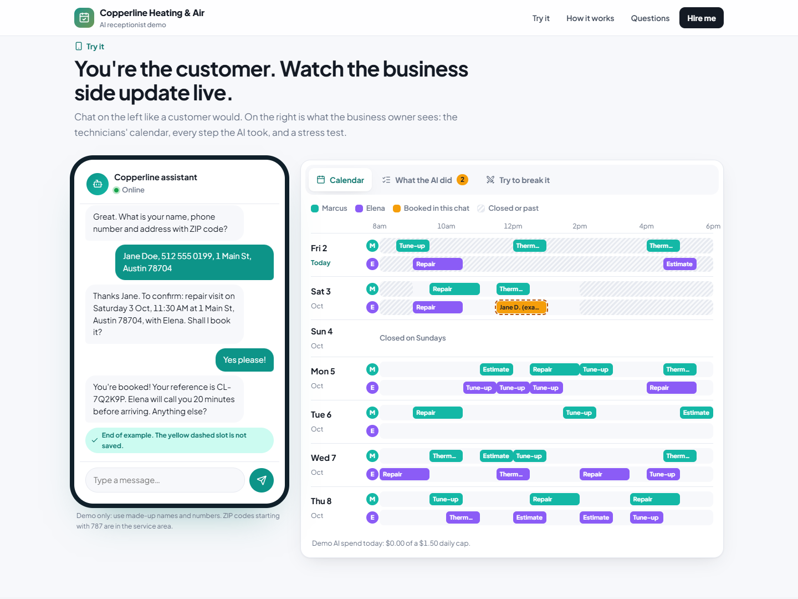

# AI receptionist that can't double-book

**Live demo:** https://reception.frankonline.cloud

A website chat assistant for a (fictional) heating and air company in Austin. Customers ask questions, find open times, book, reschedule and cancel. The business sees its technicians' calendar update live. The AI is an LLM (OpenAI or Claude) with six tools; the booking rules live in code and in the database, not in the prompt.



## What makes it production-minded

| Problem with typical AI booking bots | How this one handles it |
|---|---|
| Two customers grab the same slot | Each booking claims every 30-minute block it covers for one technician; `(tech_id, slot_utc)` is a primary key, so overlapping bookings can't both commit, even across processes. The page has a button that fires 20 simultaneous requests at one slot. |
| The AI invents availability | It can only offer times returned by `check_availability`. Opening hours, lead time, horizon and job length are enforced again in code when booking. |
| A retried tool call books twice | Bookings carry an idempotency key; a repeat returns the original booking. |
| Anyone can cancel anyone's booking | Look-up, reschedule and cancel need the reference code **and** the last 4 digits of the phone number. |
| Failed reschedule loses the original slot | The old slot is released and the new one claimed in one transaction; on conflict nothing changes. |
| Emergencies or angry customers get a bot | Gas smells, complaints, billing disputes or "I want a person" go to a staff handoff queue. |
| A public demo burns the API budget | Proof-of-work check before a chat starts, 14 messages per chat, 6 chats per IP per hour, daily call and dollar caps, `AI_ENABLED` kill switch, prompt caching. |
| Privacy | The public calendar masks names (first name + initial) and phone numbers (last 4). |

## Stack

Node 24 · Express 5 · built-in `node:sqlite` (WAL) · Luxon for time zones · OpenAI or Anthropic SDK through `llm.mjs` (strict tool use) · plain HTML/CSS/JS front end · Docker + Caddy.

```
config.mjs   business facts: services, hours, service area, policies
db.mjs       booking engine: availability, book, reschedule, cancel, handoff, demo seed data
agent.mjs    tool loop, tool schemas, input validation, cost tracking
llm.mjs      provider adapter: Claude-style messages in, OpenAI or Anthropic out
guard.mjs    proof-of-work, session limits, daily budget, kill switch
server.mjs   HTTP API: /api/config, /api/schedule, /api/challenge, /api/session, /api/chat, /api/race
public/      the demo page (chat widget + live technician calendar)
test/        booking engine tests (node --test)
```

## Run it

```bash
npm install
cp .env.example .env   # add OPENAI_API_KEY (or ANTHROPIC_API_KEY with PROVIDER=anthropic)
node --env-file=.env server.mjs   # http://localhost:5190
npm test
```

Environment: `PROVIDER` (`openai` or `anthropic`), `OPENAI_API_KEY` / `ANTHROPIC_API_KEY`, `MODEL` (default `gpt-4.1-mini` on OpenAI, `claude-opus-5` on Anthropic), `EFFORT` (Anthropic only, default `low`), `GUARD_SECRET`, `DAILY_BUDGET_USD` (1.50), `DAILY_AI_CALLS` (400), `MESSAGES_PER_SESSION` (14), `SESSIONS_PER_IP_PER_HOUR` (6), `POW_BITS` (17), `AI_ENABLED`.

## Adapting it for a real business

Swap `config.mjs` for the client's services and hours, replace the SQLite calendar with their real one (Google Calendar, Cal.com, ServiceM8, Jobber or a CRM such as GoHighLevel) behind the same `book / reschedule / cancel` functions, and add channels (WhatsApp Cloud API, SMS, voice through Vapi or Retell) that call the same agent.

Built by [Frank A.](https://www.upwork.com/freelancers/~0170dd39761ac49004), AI integration engineer.
